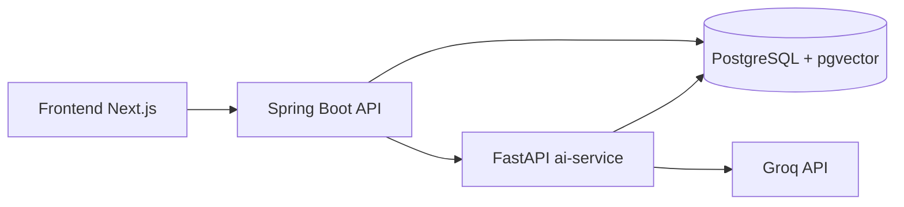
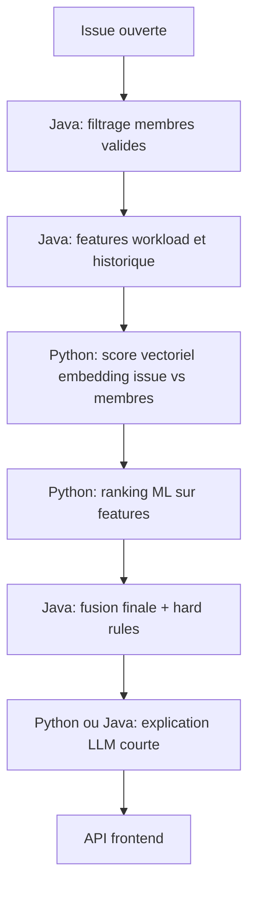

# Phase 4 — Architecture IA : Implémentation cible

> Document de référence pour l'implémentation de l'IA dans Taskforce  
> Date : Mai 2026  
> Statut : choix technique figé

---

## Décision finale

La Phase 4 sera implémentée avec une architecture hybride, orientée produit et exploitable en local:

1. Le backend public reste dans Spring Boot Java.
2. Un service IA interne en Python gère embeddings, retrieval vectoriel et ranking ML.
3. PostgreSQL devient aussi le vector store via pgvector.
4. Groq reste le fournisseur LLM pour la génération et le raisonnement.
5. La décision finale Smart Assign reste côté Java pour garder les règles métier, l'audit et les garde-fous au même endroit.

Ce choix évite deux erreurs opposées:

- faire tout en Java, ce qui ralentirait fortement la partie ML, embeddings et expérimentation;
- faire toute la logique métier en Python, ce qui disperserait les règles de sécurité, le scope workspace et l'API principale.

---

## Ce qu'on ne fera pas

### Pas de LLM-only

Le LLM ne décidera jamais seul d'un assignee ou d'une réponse métier. Il servira à:

- reformuler;
- résumer;
- expliquer;
- enrichir un ranking déjà borné par les règles métier.

### Pas de microservices multiples côté IA en V1

Il n'y aura pas de service embeddings, service ranking et service chat séparés. Un seul `ai-service` interne suffit.

### Pas de deep learning custom entraîné from scratch en V1

La V1 utilisera:

- un modèle d'embedding prêt à l'emploi;
- un ranking ML léger sur features tabulaires;
- éventuellement un reranker ou un MLP léger en V1.1 si la data réelle le justifie.

---

## Objectifs fonctionnels

La Phase 4 couvre trois capacités produit:

| Capacité | But | Sortie attendue |
| --- | --- | --- |
| Smart Assign | Recommander le meilleur assignee pour une issue | 1 recommandation + alternatives + raison |
| Assistant IA | Répondre aux questions sur un workspace via RAG | Réponse streamée + contexte métier |
| AI Insights | Résumer les signaux du workspace | Cartes et résumés dans le dashboard |

---

## Architecture cible



### Rôle de chaque bloc

#### Frontend Next.js

- appelle uniquement le backend Spring Boot;
- ne parle jamais directement à Groq ni à `ai-service`;
- consomme Smart Assign, Assistant SSE et AI Insights.

#### Backend Spring Boot

- garde toute l'authentification et le scope workspace/project/user;
- prépare les features métier;
- appelle `ai-service` pour scoring, retrieval et génération;
- fusionne règles métier + score sémantique + score ML;
- expose les endpoints publics.

#### Python `ai-service`

- génère les embeddings;
- indexe et interroge pgvector;
- calcule les scores sémantiques;
- applique le ranking ML;
- appelle Groq pour génération, résumé et explication;
- reste inaccessible depuis le navigateur.

#### PostgreSQL + pgvector

- reste la source de vérité métier;
- stocke aussi les embeddings, profils vectorisés, snapshots et traces IA;
- évite d'introduire un vector DB séparé trop tôt.

#### Groq

- sert pour le raisonnement et la génération;
- n'est pas utilisé comme moteur de décision final;
- reste derrière le backend et le `ai-service`.

---

## Stack retenue

### Backend Java

- Spring Boot 4
- WebClient pour appeler `ai-service`
- SSE pour le streaming assistant
- logique de décision Smart Assign en Java

### Service IA Python

- FastAPI
- `sentence-transformers`
- `pgvector` Python client ou SQLAlchemy + extension vector
- `scikit-learn` ou `lightgbm` pour le ranking tabulaire
- `httpx` pour Groq

### Modèles retenus

| Usage | Choix V1 | Raison |
| --- | --- | --- |
| Embeddings | `intfloat/multilingual-e5-base` ou `BAAI/bge-m3` | Multilingue, bon compromis qualité/coût |
| Ranking ML | LightGBM ou XGBoost | Efficace sur peu de features, entraînement simple |
| LLM Smart Assign rationale | `llama-3.1-8b-instant` | Rapide et peu coûteux |
| LLM Assistant / Insights | `llama-3.3-70b-versatile` | Meilleure qualité de synthèse |

### Pourquoi pas un moteur 100% Java

C'est faisable pour la partie règles et scoring déterministe, mais pas optimal pour:

- embeddings;
- retrieval vectoriel avancé;
- ranking ML léger;
- expérimentation DL future.

Conclusion: le moteur final reste en Java, la brique IA reste en Python.

---

## Données à ajouter en base

### 1. `ai_documents`

Table d'indexation RAG.

Colonnes proposées:

- `id`
- `workspace_id`
- `source_type` (`ISSUE`, `PAGE`, `DISCUSSION`, `PROJECT`, `ANALYTICS`)
- `source_id`
- `chunk_index`
- `title`
- `content`
- `metadata_json`
- `embedding vector(768)`
- `created_at`
- `updated_at`

Index:

- B-tree sur `(workspace_id, source_type, source_id)`
- HNSW sur `embedding`

### 2. `member_skill_profiles`

Profil IA d'un membre exploité par Smart Assign.

Colonnes proposées:

- `id`
- `workspace_id`
- `user_id`
- `profile_text`
- `skills_json`
- `stats_json`
- `embedding vector(768)`
- `updated_at`

### 3. `assignment_events`

Historique exploitable pour ranking ML et feedback.

Colonnes proposées:

- `id`
- `workspace_id`
- `issue_id`
- `assignee_user_id`
- `assigned_by_user_id`
- `decision_source` (`MANUAL`, `SMART_ASSIGN`, `FALLBACK`)
- `accepted`
- `resolved_successfully`
- `features_json`
- `created_at`

### 4. `ai_runs`

Traçabilité et observabilité des appels IA.

Colonnes proposées:

- `id`
- `workspace_id`
- `feature_name`
- `provider`
- `model_name`
- `latency_ms`
- `input_tokens`
- `output_tokens`
- `status`
- `fallback_used`
- `request_hash`
- `created_at`

### 5. `ai_insight_snapshots`

Cache des insights de dashboard.

Colonnes proposées:

- `id`
- `workspace_id`
- `snapshot_date`
- `summary_text`
- `exceptions_json`
- `agents_json`
- `source_metrics_json`
- `created_at`

---

## Smart Assign — fonctionnement concret

## Vue d'ensemble

Le Smart Assign ne sera pas une simple requête LLM. Le pipeline final est:



### Étape 1. Filtrage dur côté Java

Le backend Java construit la liste de candidats admissibles:

- membre du workspace;
- membre du projet si le projet est restreint;
- utilisateur actif;
- non bloqué par une règle métier;
- charge non critique si la règle d'exclusion est activée.

Le Java retire donc d'emblée les faux candidats.

### Étape 2. Features métier côté Java

Pour chaque candidat, Java calcule:

- nombre d'issues ouvertes;
- nombre d'issues urgentes en cours;
- délai moyen de résolution;
- historique sur labels similaires;
- historique sur projet similaire;
- disponibilité estimée;
- ownership du composant ou du type d'issue;
- affinité équipe et projet.

### Étape 3. Score sémantique côté Python

Le `ai-service` produit:

- embedding de l'issue;
- similarité cosine avec `member_skill_profiles`;
- similarité avec issues historiques bien résolues par le membre;
- top-k contextes proches si disponibles.

### Étape 4. Ranking ML côté Python

Le ranking ML prend les features tabulaires + le score vectoriel. V1 retenue:

- LightGBM ou XGBoost ranker ou classifier;
- entraînement périodique à partir de `assignment_events`;
- si dataset insuffisant, retour sur un score heuristique calibré.

### Étape 5. Décision finale côté Java

Java calcule le score final:

$$
score_{final} = 0.30 \cdot score_{rules} + 0.25 \cdot score_{vector} + 0.20 \cdot score_{history} + 0.15 \cdot score_{availability} + 0.10 \cdot score_{ml}
$$

Les poids sont configurables. Le LLM n'entre pas dans le calcul du score final, seulement dans l'explication.

### Étape 6. Explication courte

Le backend demande ensuite une explication courte, bornée, du type:

- pourquoi la personne 1 passe avant la personne 2;
- quelles compétences ont matché;
- quel fallback a été utilisé.

La réponse renvoyée au frontend:

```json
{
    "recommendedUserId": 42,
    "recommendedDisplayName": "Emma Petit",
    "finalScore": 0.84,
    "confidence": "HIGH",
    "reason": "Bonne affinité backend API, faible charge courante et historique positif sur les issues paiement.",
    "alternatives": [
        { "userId": 18, "score": 0.77 },
        { "userId": 7, "score": 0.69 }
    ],
    "fallbackUsed": false
}
```

---

## Assistant IA — fonctionnement concret

### Principe

L'assistant répond uniquement à partir d'un contexte autorisé par le backend.

Sources incluses en V1:

- issues;
- pages;
- discussions;
- projets;
- analytics calculées.

Sources exclues en V1:

- messages de chat temps réel;
- pièces jointes binaires;
- données externes GitHub et Slack non normalisées.

### Pipeline RAG

1. Java valide le `workspace` et l'utilisateur.
2. Java envoie au `ai-service` la requête utilisateur et les filtres autorisés.
3. Python vectorise la requête.
4. Python récupère les chunks via pgvector avec filtre `workspace_id`.
5. Python rerank les chunks.
6. Python appelle Groq avec le contexte retenu.
7. Java stream la réponse au frontend via SSE.

### Chunking retenu

| Source | Stratégie |
| --- | --- |
| Issues | titre + description + labels + derniers commentaires pertinents |
| Pages | chunks de 600 à 900 tokens avec overlap |
| Discussions | post principal + réponses récentes |
| Analytics | blocs synthétiques générés à partir des métriques |

### API publique retenue

`POST /api/workspaces/{slug}/assistant/stream`

Body:

```json
{
    "message": "Quelles issues risquent de bloquer la semaine ?",
    "mode": "workspace",
    "context": {
        "projectId": 12,
        "includeAnalytics": true
    }
}
```

Réponse:

- `text/event-stream`;
- chunks texte;
- événement final avec métadonnées de sources et fallback éventuel.

---

## AI Insights — fonctionnement concret

Les insights ne seront pas générés à chaque rendu de page.

Pipeline retenu:

1. backend calcule les métriques réelles;
2. `ai-service` produit un résumé et des anomalies;
3. le résultat est stocké dans `ai_insight_snapshots`;
4. le dashboard consomme ce snapshot;
5. régénération à la demande ou sur intervalle.

Contenu V1:

- résumé du workspace;
- risques et exceptions;
- focus équipe et capacité;
- top signaux projet;
- état simplifié des agents IA affichés dans le dashboard.

---

## API interne Python

Le `ai-service` exposera uniquement des endpoints internes.

### Indexation

- `POST /internal/index/workspace/{workspaceId}`
- `POST /internal/index/issues/{issueId}`
- `POST /internal/index/member-profile/{userId}`

### Smart Assign interne

- `POST /internal/smart-assign/semantic-score`
- `POST /internal/smart-assign/ml-rank`
- `POST /internal/smart-assign/explain`

### Assistant interne

- `POST /internal/assistant/retrieve`
- `POST /internal/assistant/respond`

### Insights internes

- `POST /internal/insights/generate`

---

## Contrats côté backend Java

### Smart Assign public

- `POST /api/workspaces/{slug}/projects/{projectId}/issues/{issueId}/smart-assign`

### Assistant public

- `POST /api/workspaces/{slug}/assistant/stream`

### Insights publics

- `GET /api/workspaces/{slug}/analytics/ai-insights`

### Services Java à créer

- `AiClientService`
- `SmartAssignService`
- `AssistantService`
- `AiInsightsService`
- `AiFeatureAssembler`
- `AiAuditService`

---

## Docker et environnement

### PostgreSQL

Le conteneur PostgreSQL de dev doit embarquer pgvector.

Choix retenu:

- image `pgvector/pgvector:pg18`;
- création explicite de l'extension `vector`.

### Nouveau service `ai-service`

Variables minimales:

```bash
AI_SERVICE_URL=http://ai-service:8001
GROQ_API_KEY=
GROQ_SMART_ASSIGN_MODEL=llama-3.1-8b-instant
GROQ_ASSISTANT_MODEL=llama-3.3-70b-versatile
EMBEDDING_MODEL=intfloat/multilingual-e5-base
AI_INDEX_BATCH_SIZE=64
AI_TOP_K=8
AI_ENABLE_SMART_ASSIGN=true
AI_ENABLE_ASSISTANT=true
AI_ENABLE_INSIGHTS=true
```

---

## Sécurité et garde-fous

### Scope

- toutes les requêtes IA passent par le backend Java;
- aucun accès direct frontend vers Groq ou `ai-service`;
- tous les appels sont filtrés par workspace et droits utilisateur.

### Observabilité

- log de latence;
- log des modèles utilisés;
- log des fallbacks;
- hash des prompts, pas stockage brut systématique;
- audit minimal dans `ai_runs`.

### Fallbacks

#### Fallback Smart Assign

Si `ai-service` ou Groq tombe:

- Java renvoie le classement déterministe pur;
- `fallbackUsed = true`.

#### Fallback Assistant

Si la génération tombe:

- renvoyer une erreur métier claire;
- conserver éventuellement la liste des sources retrouvées si utile.

#### Fallback Insights

Si la génération tombe:

- renvoyer le dernier snapshot valide;
- sinon masquer le bloc avec un état indisponible explicite.

---

## Plan d'implémentation retenu

### Lot 1 — Socle technique

1. pgvector dans Docker et en base.
2. migrations IA.
3. scaffold `ai-service` FastAPI.
4. client Java vers `ai-service`.

### Lot 2 — Smart Assign

1. assembler de features Java;
2. embeddings et profils membres;
3. scoring sémantique Python;
4. ranking ML;
5. endpoint backend;
6. intégration frontend.

### Lot 3 — Assistant

1. indexation RAG;
2. retrieval pgvector;
3. endpoint SSE backend;
4. branchement `agents/page.tsx`;
5. branchement `assistant-fab.tsx`.

### Lot 4 — AI Insights

1. snapshot pipeline;
2. endpoint backend;
3. branchement dashboard.

### Lot 5 — Qualité

1. tests unitaires Java;
2. tests pytest `ai-service`;
3. tests frontend ciblés;
4. E2E sur les parcours IA.

---

## Verdict final

Le choix définitif pour la Phase 4 est donc:

- moteur métier et décision finale en Java;
- moteur sémantique et ML en Python;
- pgvector dans PostgreSQL pour éviter un vector DB séparé;
- Groq pour la génération;
- architecture unique, réaliste, exploitable en local et extensible vers du ML et DL léger sans casser le backend existant.

Ce n'est pas la solution la plus minimaliste possible, mais c'est la plus cohérente avec:

- le monorepo actuel;
- le besoin de RAG propre;
- le besoin de ranking évolutif;
- l'envie d'aller au-delà d'un simple LLM branché à la va-vite.
